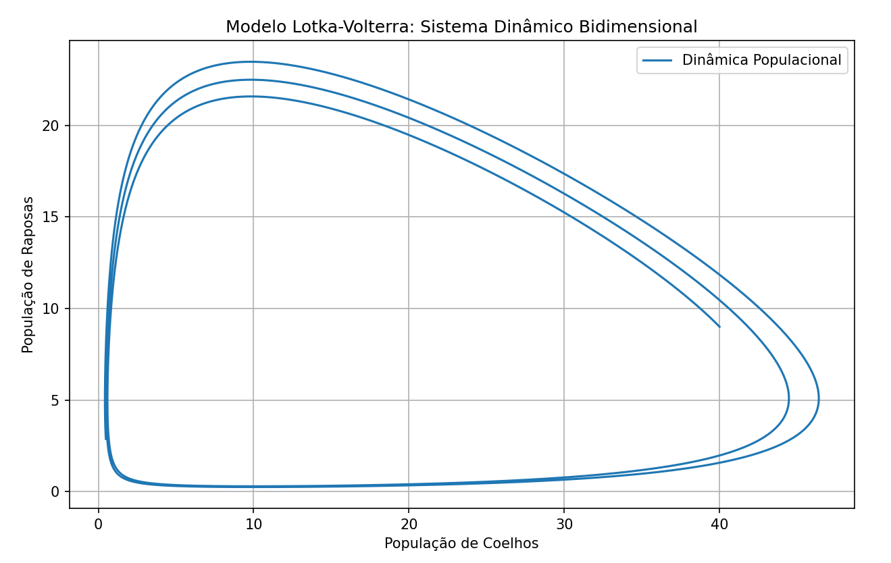
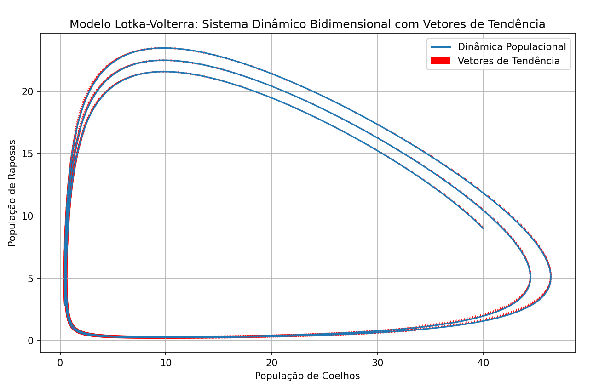
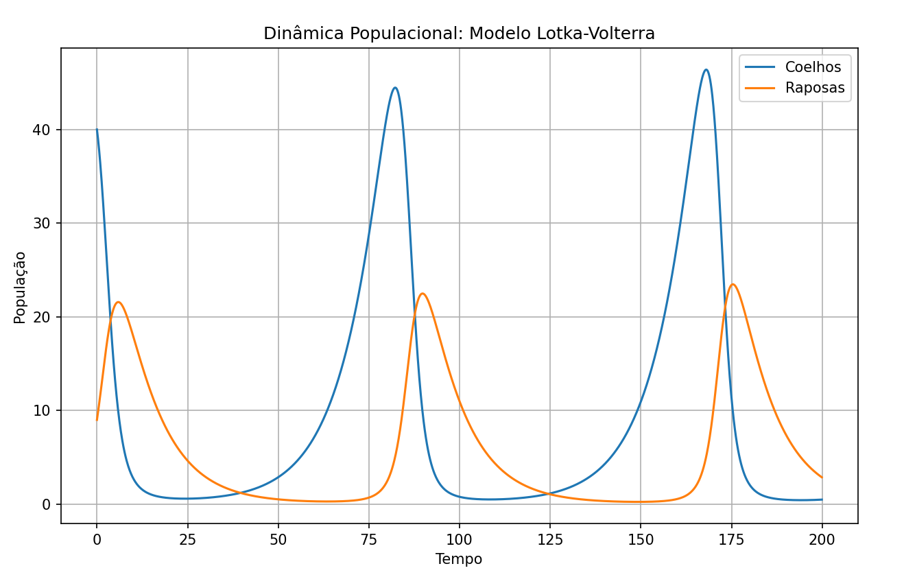

Comentários:

Parâmetros do Modelo: Os parâmetros alpha, beta, gamma e delta representam as taxas de crescimento e predação das populações de coelhos e raposas no modelo Lotka-Volterra.
Condições Iniciais: As populações iniciais de coelhos (x0) e raposas (y0) são definidas para iniciar a simulação.
Configuração do Tempo: Define o tempo total da simulação (T), o intervalo de tempo (dt) e calcula o número total de passos de tempo (num_steps).
Arrays para Armazenar Resultados: Arrays x_values, y_values e time_values são inicializados para armazenar os resultados da simulação.
Inicialização das Populações Iniciais: As populações iniciais são atribuídas às variáveis x e y.
Simulação usando o Método de Euler: As equações de Lotka-Volterra são resolvidas usando o método de Euler para cada passo de tempo.
Atualização das Populações: As populações de coelhos e raposas são atualizadas com base nas derivadas calculadas.
Plotagem do Gráfico Bidimensional: Um gráfico bidimensional é criado para visualizar a dinâmica populacional ao longo do tempo, mostrando as populações de coelhos e raposas.
-----

-----

